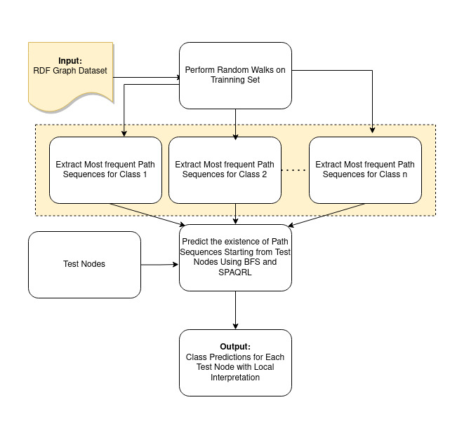
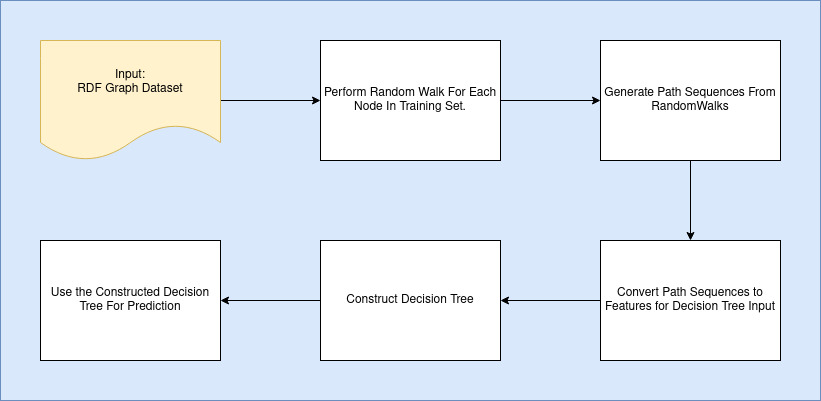

# iGraphsML

*iGraphsML* is a versatile toolkit for RDF node classification, offering flexibility in interpretability and modeling complexity. This library introduces three distinct approaches, all beginning with a random walk algorithm on an RDF graph dataset.

## Table of Contents

- [Solution Overview](#solution-overview)
- [Usage](#usage)
  - [Approach: Decision Tree](#approach-decision-tree)
  - [Approach: OneR](#approach-oner)
  - [Approach: Random Walk and Prediction With SPARQL](#approach-random-walk-and-prediction-with-sparql)


## Solution Overview
A brief description of the three approaches:
### SPARQL Classification Approach

- Applies random walks on the training set to generate diverse paths in the graph.
- Selects the most frequent paths for each class, serving as crucial features for classification.
- Predictions leverage these chosen path sequences, providing effective classification results.
- Illustrates local interpretability by presenting path sequences.



### Decision Tree Approach

- Conducts a random walk for each node in the training set, gathering path sequences.
- Consolidates path sequences from all training nodes to create a feature set.
- Utilizes this feature set to construct a decision tree for prediction.



### OneR Approach

- Emphasizes simplicity and interpretability in node classification.
- Uses random walk techniques for feature construction, similar to the decision tree approach.
- Employs the One Rule (OneR) algorithm for classifier construction, suitable for both binary and multiclass scenarios.
- Generates concise and interpretable decision rules for accurate predictions.


## Usage
- For all the three approaches first we need to load the dataset along with the test and train data.
```python
from data.rdf import MUTAGDataset, AIFBDataset, BGSDataset, CarcinogenesisDataset
# path of the dataset
rootpath = './raw_data/MUTAG/mutag-hetero/'
training_path = 'trainingSet.tsv'
test_path = 'testSet.tsv'

rdf_data = MUTAGDataset(rootpath, training_path, test_path)

# Load the graph
rdf_graph = rdf_data.load_rdf_graph()

# Read test data
test_data = rdf_data.read_testing_data()

# Read train data
training_data = rdf_data.read_training_data()

```
### Decision Tree model:
```python
from utils.rdf_decision_tree_node_classifier import RDFDecisionTreeNodeClassifier

# Initialize the RDFDecisionTreeNodeClassifier
gp = RDFDecisionTreeNodeClassifier(rdf_graph)

# Fit the classifier to training data
gp.fit(training_data, None, 4, 3)

# Make predictions on test data
predictions, actual_labels = gp.predict(test_data, None, 4, 3)

# Evaluate the performance
from sklearn.metrics import accuracy_score
accuracy = accuracy_score(predictions, actual_labels)
print(f"Accuracy: {accuracy}")
```
### SPARQL Classification Approach
```python
from utils.rdf_sparql_node_classifier import RDFNodeClassifierWithSPARQL

# Initialize the RDFNodeClassifierWithSPARQL
classifier = RDFNodeClassifierWithSPARQL(rdf_graph)

# Fit the classifier to  training data
classifier.fit(training_data, None, num_walks=4, walk_depth=3)

# Make predictions on test data
predictions, actual_labels = classifier.predict(test_data)

# Evaluate the performance
from sklearn.metrics import accuracy_score
accuracy = accuracy_score(predictions, actual_labels)
print(f"Accuracy: {accuracy}")
```
### One R Classification Approach
```python
from utils.one_r import OneRClassifier

# Get Unique Classes
class_names = rdf_data.get_unique_classes()

# Initialize the OneRClassifier
classifier = OneRClassifier(graph, class_names)

# Fit the classifier to  training data
classifier.fit(training_data, None, num_walks=4, walk_depth=3)

# Make predictions on test data
predictions, actual_labels = classifier.predict(test_data)

# Evaluate the performance
from sklearn.metrics import accuracy_score
accuracy = accuracy_score(predictions, actual_labels)
print(f"Accuracy: {accuracy}")
```
